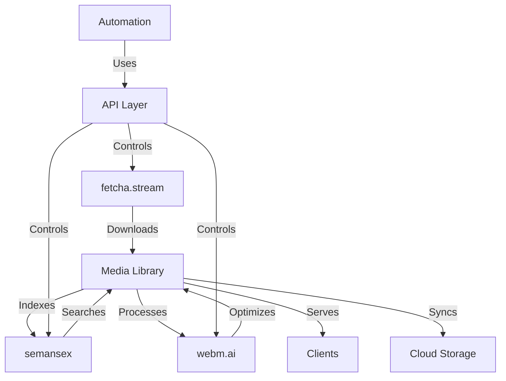

# fetcha.stream - Future Evolution Roadmap

> **IMPORTANT**: This document describes the long-term vision AFTER completing Phases 1-5 of the current yt-dlp-MAX/fetcha.stream project. This is a separate evolution track that begins after the core product achieves A+ quality.

## Current Project Status
- **Active Development**: Phase 4 (Testing, Documentation & Polish)
- **Next**: Phase 5 (Pro Features - Browser Integration, Scheduling, etc.)
- **Then**: Fork to this Evolution roadmap

---

## The Vision: Media Ecosystem Evolution

Transform fetcha.stream from a best-in-class downloader into a comprehensive media intelligence platform that makes Jellyfin and Plex obsolete through modern architecture and AI-powered features.

## Evolution Stages (Post-Phase 5)

### 🌅 **Evolution Stage A: Integration Foundation**
*Timeline: 3-6 months after Phase 5 completion*

#### Goals
- Establish fetcha.stream as a platform, not just an app
- Create foundation for ecosystem integration
- Maintain simplicity while adding power

#### Core Components

**1. API Control Layer**
- RESTful API for all current operations
- WebSocket for real-time updates
- Authentication system (API keys, OAuth2)
- Rate limiting and security

**2. Storage Provider Abstraction**
- Local filesystem (current)
- WebDAV (Synology, TrueNAS, NextCloud)
- S3-compatible (AWS, MinIO, Backblaze)
- Prepare for cloud providers

**3. Event System**
- Every action emits events
- Webhook support for automation
- Event history and replay
- Plugin hooks

#### Deliverables
- fetcha.stream API Server v1.0
- Storage abstraction layer
- Event broadcasting system
- API documentation

---

### 🚀 **Evolution Stage B: Ecosystem Integration**
*Timeline: 6-12 months after Evolution A*

#### Goals
- Integrate with companion products
- Enable complex automation workflows
- Expand storage options

#### Integrations

**1. semansex Integration**
- Semantic search across downloaded media
- Auto-tagging and categorization
- Content recommendations
- Natural language queries
- Metadata enrichment pipeline

**2. webm.ai Integration**
- Automatic format optimization
- Intelligent transcoding
- Scene detection and chaptering
- Thumbnail generation
- Quality enhancement

**3. Cloud Storage Providers**
- Dropbox
- Google Drive
- OneDrive
- iCloud Drive
- Box

**4. Automation Platforms**
- n8n custom nodes
- Node-RED flows
- Home Assistant integration
- Zapier/Make.com connectors
- Rewst workflows

#### Deliverables
- Unified media intelligence API
- 10+ storage provider integrations
- Automation platform connectors
- Plugin marketplace foundation

---

### 🌍 **Evolution Stage C: Cross-Platform Expansion**
*Timeline: 12-18 months after Evolution B*

#### Goals
- True cross-platform availability
- Unified experience across devices
- Headless server mode

#### Platform Strategy

**Shared Core** (Rust/C++)
```
fetcha-core/
├── downloader/     # yt-dlp wrapper
├── queue/          # Queue management
├── storage/        # Storage abstraction
├── search/         # semansex integration
├── processor/      # webm.ai integration
└── api/            # API server
```

**Native Clients**
- **macOS/iOS**: Current Swift/SwiftUI (enhanced)
- **Windows**: WinUI 3 or Tauri
- **Linux**: GTK4 or Tauri
- **Android**: Kotlin/Jetpack Compose
- **Web**: Progressive Web App

**Server Mode**
- Docker containers
- Kubernetes helm charts
- Headless operation
- Multi-user support
- Distributed processing

#### Deliverables
- fetcha-core library
- Native apps for all platforms
- Docker images
- Helm charts
- Web interface

---

### 🎯 **Evolution Stage D: Market Disruption**
*Timeline: 18-24 months after Evolution C*

#### Goals
- Complete media server replacement
- Enterprise features
- Commercial viability

#### Advanced Features

**Media Server Capabilities**
- DLNA/UPnP server
- Chromecast support
- Transcoding on-demand
- Multi-user permissions
- Parental controls
- Watch history sync

**AI-Powered Organization**
- Automatic library organization
- Face recognition in videos
- Content-based deduplication
- Smart playlists
- Viewing recommendations

**Enterprise Features**
- LDAP/Active Directory
- SSO (SAML, OIDC)
- Audit logging
- Compliance tools
- SLA monitoring

#### Competitive Advantages Over Jellyfin/Plex

| Feature | Jellyfin/Plex | fetcha.stream |
|---------|--------------|---------------|
| Setup | Complex | Zero-config |
| Search | Basic text | Semantic AI |
| Downloads | External tools | Built-in |
| Storage | Local only | Multi-cloud |
| Automation | Limited | Full API |
| Intelligence | None | AI-powered |
| Architecture | Monolithic | Microservices |

#### Deliverables
- Complete media server
- Enterprise edition
- SaaS offering
- Support contracts

---

## Product Suite Synergy

### The Ecosystem Vision



### Integration Architecture

**1. fetcha.stream** (Media Acquisition)
- Intelligent downloading
- Queue management
- Format selection
- Metadata extraction

**2. semansex** (Semantic Intelligence)
- Vector embeddings for all media
- Natural language search
- Content-based recommendations
- Automatic categorization

**3. webm.ai** (Media Processing)
- Format optimization
- Quality enhancement
- Intelligent transcoding
- Scene analysis

**4. Unnamed API Interface** (Control Plane)
- Universal API gateway
- Service orchestration
- Event routing
- Security layer

---

## Technical Architecture Evolution

### Current Architecture (Phase 1-5)
```
Simple, monolithic Mac app
├── Swift/SwiftUI UI
├── YTDLPService
├── Local storage
└── UserDefaults
```

### Evolution Architecture
```
Distributed, service-oriented platform
├── Core Services (containerized)
│   ├── Download Service
│   ├── Queue Service
│   ├── Storage Service
│   ├── Search Service (semansex)
│   ├── Processing Service (webm.ai)
│   └── API Gateway
├── Data Layer
│   ├── PostgreSQL (metadata)
│   ├── Vector DB (embeddings)
│   ├── Redis (cache/queue)
│   └── Object Storage (media)
├── Client Applications
│   ├── Native Apps
│   ├── Web App
│   └── CLI
└── Integration Layer
    ├── Webhooks
    ├── WebSockets
    └── gRPC
```

---

## Development Principles for Evolution

### 1. **Backwards Compatibility**
- Never break existing workflows
- Gradual migration paths
- Feature flags for new capabilities

### 2. **Progressive Enhancement**
- Core features work offline
- Cloud features are additive
- Degradation is graceful

### 3. **API Stability**
- Versioned APIs
- Deprecation notices
- Migration guides

### 4. **Plugin Architecture**
```swift
protocol FetchaPlugin {
    var identifier: String { get }
    var version: String { get }
    func initialize(context: PluginContext) async throws
    func handleEvent(_ event: AppEvent) async
}
```

### 5. **Scalability First**
- Horizontal scaling from day one
- Stateless services
- Queue-based processing
- Caching strategies

---

## Business Model Evolution

### Current (Phase 1-5)
- Free, open-source Mac app
- Community-driven development
- Optional donations

### Evolution Stage A-B
- **Free Tier**: Core features, local storage
- **Pro Tier** ($5/month): Cloud storage, API access
- **Team Tier** ($20/month): Multi-user, priority support

### Evolution Stage C-D
- **Personal**: Free forever for basic use
- **Pro**: $10/month for power users
- **Business**: $50/month for teams
- **Enterprise**: Custom pricing
- **SaaS**: Managed cloud hosting

---

## Success Metrics

### Evolution A Success
- 1,000+ API calls/day
- 5+ storage providers
- 100+ automation workflows

### Evolution B Success
- 10,000+ active users
- 50% using AI features
- 1M+ media items indexed

### Evolution C Success
- 100,000+ users across platforms
- 10% paid conversion
- Replace Jellyfin for early adopters

### Evolution D Success
- 1M+ users globally
- $1M ARR
- Industry recognition
- Acquisition offers

---

## Risk Mitigation

### Technical Risks
- **Complexity**: Modular architecture, clean interfaces
- **Performance**: Profiling, caching, CDN
- **Security**: Regular audits, bug bounties

### Market Risks
- **Competition**: Unique AI features, better UX
- **Adoption**: Freemium model, easy migration
- **Sustainability**: Multiple revenue streams

---

## Next Steps After Phase 5

1. **Community Feedback** on evolution roadmap
2. **Technical Spike** on API architecture
3. **Partnership Discussions** with storage providers
4. **Funding Exploration** for accelerated development
5. **Team Building** for specialized roles

---

*This document represents the ambitious long-term vision. The immediate focus remains on completing Phases 4-5 of the current yt-dlp-MAX/fetcha.stream project to achieve A+ quality in the core product.*

*Last Updated: 2024*
*Next Review: After Phase 5 Completion*